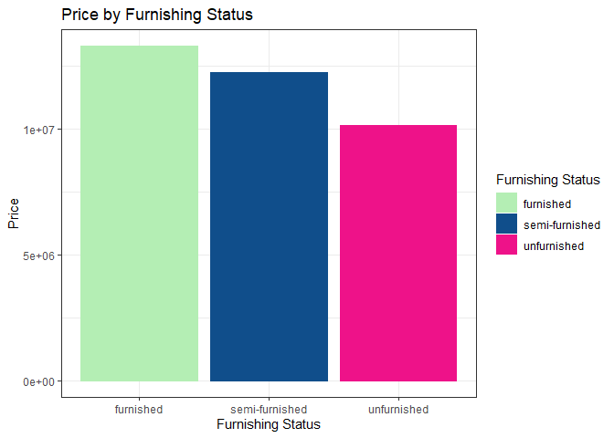
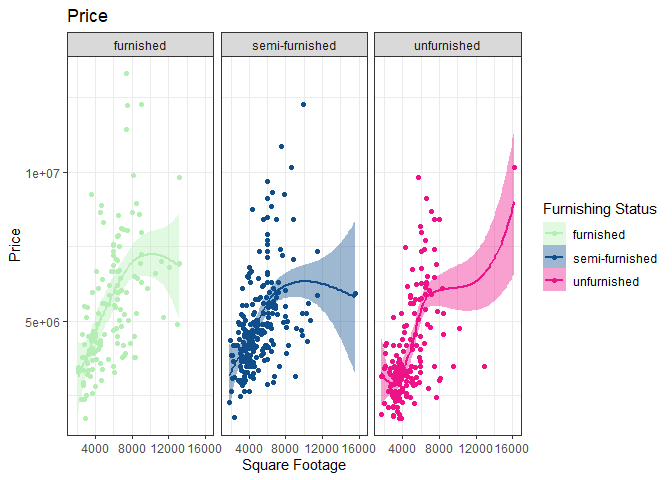
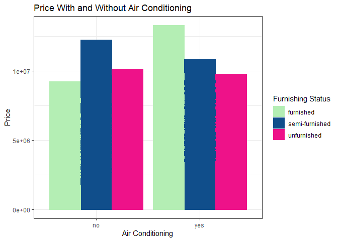

</br>

# Stuff {.tabset .tabset-pills .tabset-fade}

</br>

## Stuff 2

### Getting the Data


```r
house <- read.csv("~/A Bunch of Classes/The Senior Project/Senior Project/Housing.csv")
pander(names(house))
```

_price_, _area_, _bedrooms_, _bathrooms_, _stories_, _mainroad_, _guestroom_, _basement_, _hotwaterheating_, _airconditioning_, _parking_, _prefarea_ and _furnishingstatus_

```r
scheme <- c("darkseagreen2", "dodgerblue4", "deeppink2")
```


```r
house %>% 
  ggplot(aes(fill = furnishingstatus, color = furnishingstatus, x = furnishingstatus, y = price)) +
  geom_col(position = "dodge") +
  scale_color_manual(values = scheme) +
  scale_fill_manual(values = scheme) +
  labs(title = "Price by Furnishing Status", x = "Furnishing Status", y = "Price", fill = "Furnishing Status", color = "Furnishing Status") +
  theme(plot.title = element_text(hjust = 0.5)) +
  theme_bw()
```

<!-- -->


```r
house %>% 
  ggplot(aes(fill = furnishingstatus, color = furnishingstatus, x = area, y = price)) +
  geom_point() +
  geom_smooth() +
  facet_wrap(~ furnishingstatus) +
  scale_color_manual(values = scheme) +
  scale_fill_manual(values = scheme) +
  labs(title = "Price", x = "Square Footage", y = "Price", fill = "Furnishing Status", color = "Furnishing Status") +
  theme(plot.title = element_text(hjust = 0.5)) +
  theme_bw()
```

```
## `geom_smooth()` using method = 'loess' and formula 'y ~ x'
```

<!-- -->


```r
house %>% 
  ggplot(aes(fill = furnishingstatus, color = furnishingstatus, x = airconditioning, y = price)) +
  geom_col(position = "dodge") +
  scale_color_manual(values = scheme) +
  scale_fill_manual(values = scheme) +
  labs(title = "Price With and Without Air Conditioning", x = "Air Conditioning", y = "Price", fill = "Furnishing Status", color = "Furnishing Status") +
  theme(plot.title = element_text(hjust = 0.5)) +
  theme_bw()
```

<!-- -->


```r
house %>% 
  ggplot(aes(fill = furnishingstatus, color = furnishingstatus, x = airconditioning, y = price)) +
  geom_col(position = "dodge") +
  scale_color_manual(values = scheme) +
  scale_fill_manual(values = scheme) +
  labs(title = "Price With and Without Air Conditioning", x = "Air Conditioning", y = "Price", fill = "Furnishing Status", color = "Furnishing Status") +
  theme(plot.title = element_text(hjust = 0.5)) +
  theme_bw()
```

<!-- -->


```r
#full5 <- full1 %>%
  #filter(card == "Visa Cash Back Rewards") %>%
  #group_by(ukey) %>%
  #slice_max(total.profit) %>%
  #arrange(desc(total.profit)) %>%
  #head(100) %>%
  #select(-c(GeoCoord, BranchAddress, cust.lat, cust.long, branch.lat, branch.long,
            #id, geometry))

#full6 <- full1 %>%
  #filter(card == "Visa Platinum") %>%
  #group_by(ukey) %>%
  #slice_max(total.profit) %>%
  #arrange(desc(total.profit)) %>%
  #head(100) %>%
  #select(-c(GeoCoord, BranchAddress, cust.lat, cust.long, branch.lat, branch.long,
            #id, geometry))
```

</br>


```r
#c1 <- full5 %>% 
  #ggplot(aes(color= Gender, fill = Gender, x = Gender, y = total.profit)) + #Initial graph code
  #geom_col(position = "dodge") + # This tells it to make a bar chart
  #scale_color_manual(values = c("Male" = "dodgerblue4", "Female" = "deeppink2", "Undetermined" = "darkseagreen2")) +
  #scale_fill_manual(values = c("Male" = "dodgerblue4", "Female" = "deeppink2", "Undetermined" = "darkseagreen2")) +
  # Manually saying what colors to make the values
  #labs(title = "Visa Cash Back Rewards", x = "Card Type", y = "Total Profit", fill = "Gender", color = "Gender") + # Changing the labels on the plot
  #theme_bw() + #Changes plot background to dark
  #coord_cartesian(ylim = c(0, 30000)) +
  #theme(plot.title = element_text(hjust = 0.5), legend.position = "bottom",
        #axis.title.x = element_blank()) # Changing the Title text to be centered

#c2 <- full6 %>% 
  #ggplot(aes(color = Gender, fill = Gender, x = Gender, y = total.profit)) + #Initial graph code
  #geom_col(position = "dodge") + # This tells it to make a bar chart
  #scale_color_manual(values = c("Male" = "dodgerblue4", "Female" = "deeppink2", "Undetermined" = "darkseagreen2")) +
  #scale_fill_manual(values = c("Male" = "dodgerblue4", "Female" = "deeppink2", "Undetermined" = "darkseagreen2")) + # Manually saying what colors to make the values
  #labs(title = "Visa Platinum", x = "Card Type", y = "Total Profit", fill = "Gender", color = "Gender") + # Changing the labels on the plot
  #theme_bw() + #Changes plot background to dark
  #coord_cartesian(ylim = c(0, 30000)) +
  #theme(plot.title = element_text(hjust = 0.5), legend.position = "bottom",
        #axis.title.x = element_blank())


#c1 + c2 + plot_layout(guides = "collect") &
  #theme(legend.position = "bottom")
```

</br>


```r
#full5 %>% 
  #ggplot(aes(color= Gender, fill = Gender, x = Age, y = total.profit)) + #Initial graph code
  #geom_point() +
  #geom_smooth() + # This tells it to make a bar chart
  #facet_wrap(~ Gender, ncol = 3) +
  #scale_color_manual(values = c("Male" = "dodgerblue4", "Female" = "deeppink2", "Undetermined" = "darkseagreen2")) +
  #scale_fill_manual(values = c("Male" = "dodgerblue4", "Female" = "deeppink2", "Undetermined" = "darkseagreen2")) +
  # Manually saying what colors to make the values
  #labs(title = "Visa Cash Back Rewards", x = "Age", y = "Total Profit", fill = "Gender", color = "Gender") + # Changing the labels on the plot
  #theme_bw() + #Changes plot background to dark
  #coord_cartesian(ylim = c(0, 30000)) +
  #theme(plot.title = element_text(hjust = 0.5), legend.position = "bottom") # Changing the Title text to be centered

#full6 %>% 
  #ggplot(aes(color = Gender, fill = Gender, x = Age, y = total.profit)) + #Initial graph code
  #geom_point() +
  #geom_smooth() +
  #facet_wrap(~ Gender, ncol = 3) +
  #scale_color_manual(values = c("Male" = "dodgerblue4", "Female" = "deeppink2", "Undetermined" = "darkseagreen2")) +
  #scale_fill_manual(values = c("Male" = "dodgerblue4", "Female" = "deeppink2", "Undetermined" = "darkseagreen2")) + # Manually saying what colors to make the values
  #labs(title = "Visa Platinum", x = "Age", y = "Total Profit", fill = "Gender", color = "Gender") + # Changing the labels on the plot
  #theme_bw() + #Changes plot background to dark
  #coord_cartesian(ylim = c(0, 30000)) +
  #theme(plot.title = element_text(hjust = 0.5), legend.position = "bottom")
```

</br>


</br>


```r
#"" = "dodgerblue4", "" = "deeppink2", "" = "darkseagreen2"
```

